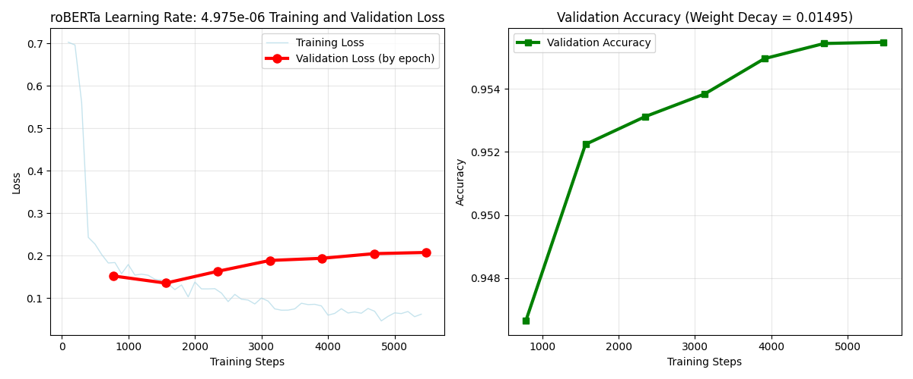

# RoBERTa-base Fine-Tuned for IMDB Sentiment Analysis

A high-performance sentiment classifier fine-tuned from `roberta-base` on the full IMDB movie review dataset (positive vs negative).

**Final Validation Accuracy**: ~95.57%  
**Best Hyperparameters**:

Learning Rate: 4.975e-6

Weight Decay: 0.01495

Epochs: 7

Batch Size: 32

Scheduler: linear with 10% warmup

## Model Performance

**Validation Accuracy**: 95.55–95.57%

Extremely clean training curves with minimal overfitting

Near-perfect results on 20 diverse test examples (high confidence scores)

## Quick Start

### Installation
```bash
git clone https://github.com/moreheaj/roberta-imdb-sentiment.git
cd roberta-imdb-sentiment
pip install -r requirements.txt
```

###Results Chart


### Inference Results After Finetuning

Base model: roberta-base

Dataset: IMDB

Built with Hugging Face Transformers

=== Extended Test Inferences (20 examples) ===

1. Positive (0.9987) | This movie was absolutely fantastic and I loved every minute of it!
2. Negative (0.9991) | The worst film I have ever seen. Total waste of time and money.
3. Negative (0.9983) | Great acting but the plot was boring and predictable.
4. Positive (0.9989) | One of the best movies of the year! Highly recommended.
5. Negative (0.9992) | Terrible script, bad acting, and zero entertainment value.
6. Positive (0.9977) | I laughed, I cried, I couldn't stop watching. Masterpiece!
7. Negative (0.9990) | Don't waste your time. This is the most disappointing movie ever.
8. Negative (0.9924) | The visuals were stunning but the story fell flat.
9. Positive (0.9983) | A brilliant performance by the lead actor. 10/10!
10. Negative (0.9991) | Horrible dialogue and the ending made no sense at all.
11. Positive (0.9989) | This film exceeded all my expectations. What a gem!
12. Negative (0.9985) | Extremely slow-paced and not worth watching.
13. Positive (0.9986) | The best superhero movie I've seen in years.
14. Negative (0.9981) | Awful directing and terrible CGI. Avoid at all costs.
15. Positive (0.9984) | Heartwarming story with excellent cast and soundtrack.
16. Negative (0.9971) | Completely overrated. Nothing special here.
17. Positive (0.9955) | Incredible cinematography and emotional depth.
18. Negative (0.9983) | The acting was so bad it was almost funny.
19. Positive (0.9990) | A perfect blend of humor, action, and drama. Loved it!
20. Negative (0.9991) | One of the most boring experiences I've had at the cinema.
